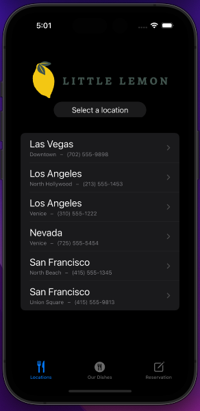
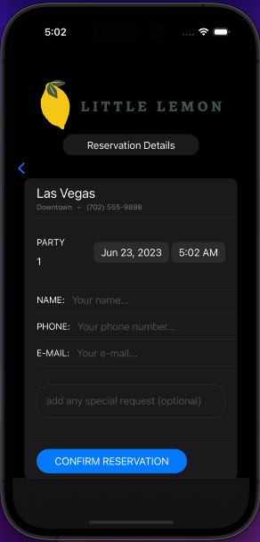
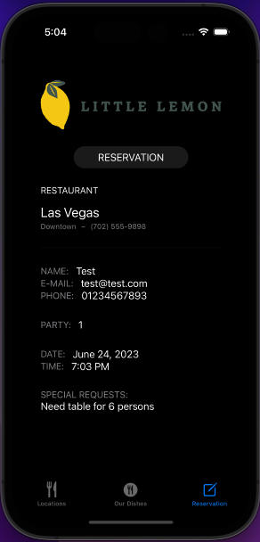
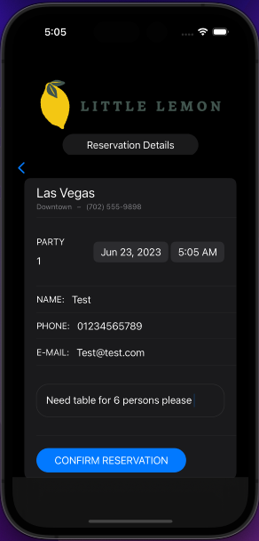
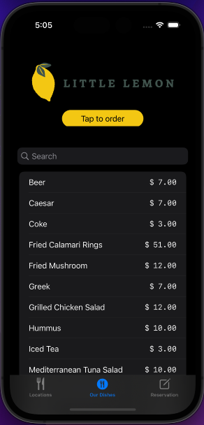

# Little-Lemon-dinner-menu 
it's a project practicing swiftui and REST api and CoreData in meta ios Meta iOS Developer Professional Certificate

its a project for 
 Markup : - [x] Reserve a table for specific date and time
          - [x] Sorting and filtering the food menu using NSPredicate and NSSortDescriptor
          - [x] Review Reserved table requests 

vedio Demo :
https://github.com/Ayman-Naim/Restaurant-app-ios/assets/52940205/0aa51f3d-8935-4c42-a24d-aae8e45771fa

screenshots:

